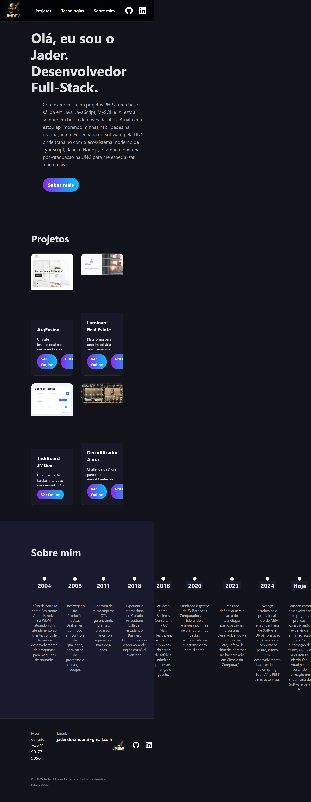

# Portfólio Profissional - Desafio de Engenharia de Software

Este projeto é um portfólio profissional desenvolvido como parte de um desafio para o curso de Engenharia de Software da DNC. O objetivo foi criar uma página única (Single-Page Application) atraente e funcional para apresentar habilidades, projetos e trajetória profissional, utilizando tecnologias modernas do ecossistema React.

## 🚀 Acesso ao Projeto

Você pode visualizar o projeto final em funcionamento no seguinte link:

**[https://jmdev-portfolio-25bnh7yu8-jaders-projects-74796e1a.vercel.app/](https://jmdev-portfolio-25bnh7yu8-jaders-projects-74796e1a.vercel.app/)**

## 📸 Screenshot



---

## 📖 Sobre o Projeto

### 📝 Documentação do Template (Critério de Avaliação)

Conforme especificado nos critérios do desafio, este projeto foi desenvolvido com base no **Template 02** fornecido no Figma. Todo o layout, componentes e estilização seguiram as diretrizes do template selecionado para garantir consistência visual e cumprimento dos requisitos.

### ✨ Funcionalidades e Requisitos Cumpridos

- **Componentização:** A aplicação foi dividida em componentes reutilizáveis para cada seção (Header, Hero, Projects, AboutMe, Footer).
- **Dados Centralizados:** As informações de projetos e da linha do tempo são gerenciadas em um arquivo `data.ts`, facilitando futuras atualizações.
- **Uso de Hooks (`useState` e `useEffect`):** O projeto utiliza os hooks `useState` e `useEffect` para cumprir os requisitos do desafio. O `useEffect` foi utilizado para definir o título da página dinamicamente.

## 🛠️ Tecnologias Utilizadas

- **React:** Biblioteca principal para a construção da interface.
- **TypeScript:** Para adicionar tipagem estática e segurança ao código.
- **Vite:** Ferramenta de build e desenvolvimento local de alta performance.
- **CSS Modules:** Para estilização escopada e organizada por componente.
- **React Icons:** Para a utilização de ícones vetoriais (GitHub, LinkedIn).
- **Vercel:** Para deploy e hospedagem do projeto.

---

## ⚙️ Como Executar o Projeto Localmente

Siga os passos abaixo para rodar o projeto na sua máquina:

1.  **Clone o repositório:**
    ```bash
    git clone [https://github.com/Jader-Moura-Lattarulo/RID190845_Desafio04_Portfolio.git](https://github.com/Jader-Moura-Lattarulo/RID190845_Desafio04_Portfolio.git)
    ```
2.  **Navegue até a pasta do projeto:**
    ```bash
    cd RID190845_Desafio04_Portfolio
    ```
3.  **Instale as dependências:**
    ```bash
    npm install
    ```
4.  **Inicie o servidor de desenvolvimento:**
    ```bash
    npm run dev
    ```
O projeto estará disponível em `http://localhost:5173` (ou outra porta indicada no terminal).

## 👨‍💻 Autor

**Jader Moura Lattarulo**

- **LinkedIn:** [https://www.linkedin.com/in/dev-jader/](https://www.linkedin.com/in/dev-jader/)
- **GitHub:** [https://github.com/Jader-Moura-Lattarulo](https://github.com/Jader-Moura-Lattarulo)